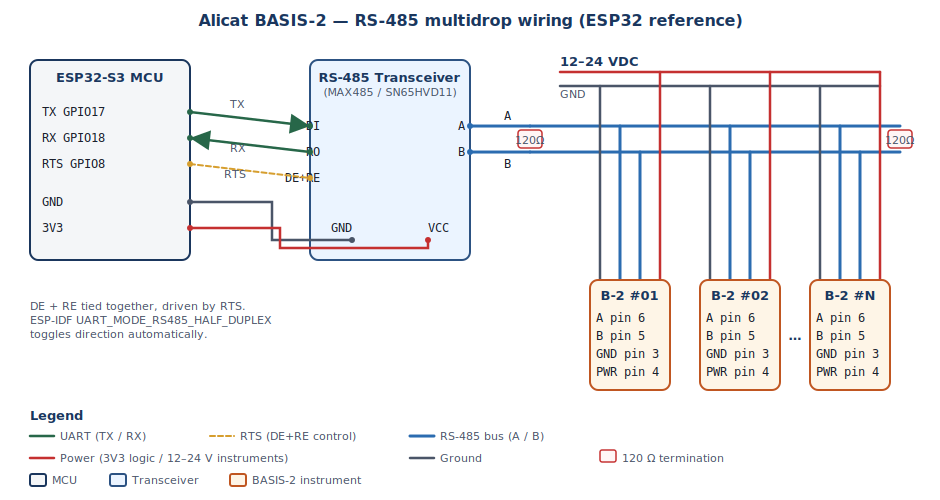

# Hardware setup — RS-485 bus

## Connector pinout

Per the BASIS-2 datasheet, the 6-pin JST-GH connector on top of every
instrument carries:

| Pin | Function                                                              |
| --- | --------------------------------------------------------------------- |
| 1   | Analog setpoint input (controllers only) / ground to tare (meters)    |
| 2   | Analog signal output (0–5 V or 4–20 mA)                               |
| 3   | Ground                                                                |
| 4   | Power in **12–24 VDC** (210 mA controllers, 12 mA meters)             |
| 5   | Serial RS-232 **Rx** *or* RS-485 **B (+)**                            |
| 6   | Serial RS-232 **Tx** *or* RS-485 **A (−)**                            |

> ⚠️ Apply power on **pin 4 only**. Connecting power to any other pin
> can permanently damage the instrument.

## RS-485 multidrop topology

Up to **247** BASIS-2 instruments may share the same RS-485 pair. Wire
A/B as a single trunk with 120 Ω termination at both ends; T-stubs to
each instrument should stay short (≤ 30 cm).

```
   ┌────────────┐   RS-485 A/B
   │  MCU UART  ├── (DE/RE auto-toggled by ESP-IDF UART RS-485 mode)
   └─────┬──────┘
         │ shared bus
   ┌─────┴───────────────────────────────────────────────┐
   │                                                     │
┌──┴───┐  ┌──────┐  ┌──────┐  ┌──────┐  ┌──────┐  ...  ┌──────┐
│ B-2  │  │ B-2  │  │ B-2  │  │ B-2  │  │ B-2  │       │ B-2  │
│ #01  │  │ #02  │  │ #03  │  │ #04  │  │ #05  │       │ #247 │
└──────┘  └──────┘  └──────┘  └──────┘  └──────┘       └──────┘
```

## Transceiver wiring (ESP32-S3 reference)



Use any half-duplex RS-485 transceiver (SN65HVD11, MAX485, ADM2587E,
…). Tie DE+RE together and drive them from a single GPIO; ESP-IDF's
`UART_MODE_RS485_HALF_DUPLEX` toggles the line for you.

```
ESP32-S3                  Transceiver                BASIS-2 chain
─────────                 ───────────                ──────────────
GPIO17  TX  ────────────► DI                  ┌──── pin 6 (A−)
GPIO18  RX  ◄──────────── RO                  │     pin 5 (B+)
GPIO8   RTS ────────────► DE  + RE  (tied)    │
                          A   ─────── A bus ──┘
                          B   ─────── B bus
GND        ──────────────► GND               ───── pin 3 (GND)
3V3        ──────────────► VCC (logic side)
                          120 Ω termination at each end of the bus
12–24 V        ────────────────────────────── pin 4 (POWER)
```

## First power-up — assigning addresses

Out of the factory **every** BASIS-2 ships with Modbus address `1` and
ASCII unit id `'A'`. To enumerate a fresh bench:

1. Connect **only one** instrument at a time.
2. `DiscoverPresentAddresses()` confirms it answers at address 1.
3. `SetModbusAddress(N)` to assign a unique address.
4. (Optional) `SetAsciiUnitId('B'..'Z')` if you also use the ASCII protocol.
5. Plug in the next instrument and repeat.

After every instrument has its own address you can permanently leave the
chain wired together; the driver addresses each slave by its programmed
Modbus id.

## Baud-rate change (datasheet warning)

`SetBaudRate()` switches the slave to the new baud immediately after
ack'ing the write. The host must:

1. Issue the command at the **old** baud.
2. Drain the response at the old baud.
3. Reconfigure the host UART to the **new** baud.
4. (Optional) Issue a `ReadIdentity()` to confirm.

Skip step 2 and the host will see line noise on the next read.

**Next:** [CMake integration →](cmake_integration.md)
